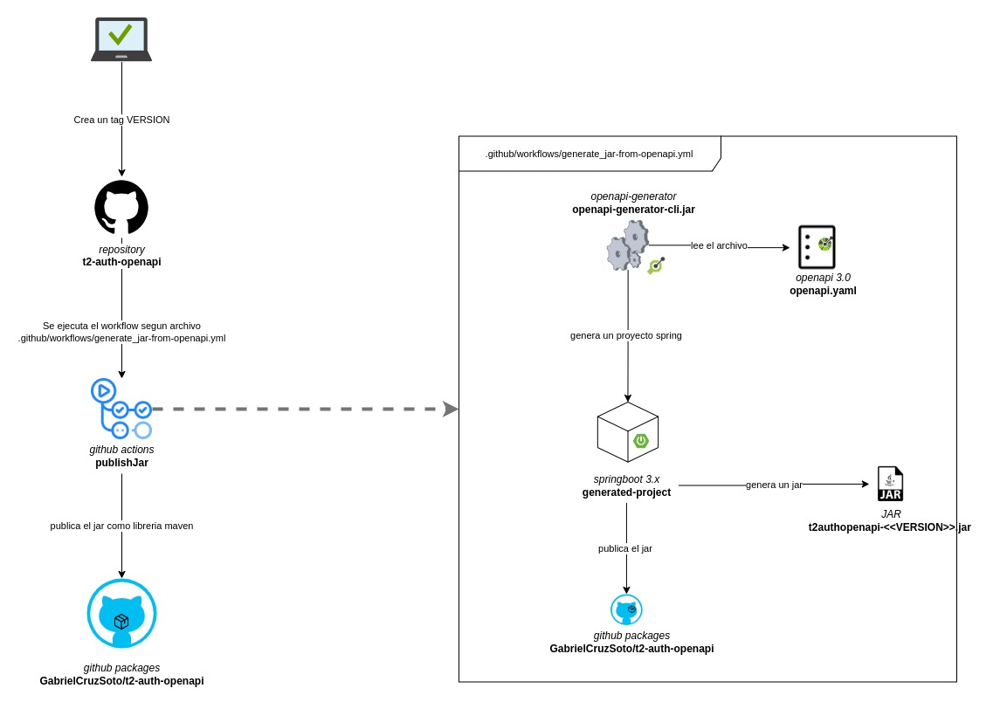

# t2authopenapi

t2authopenapi es un proyecto que proporciona una API para la creación y autenticación de usuarios. El proyecto utiliza OpenAPI para definir la interfaz de la API y Spring Boot para implementarla.

## Diagrama de flujo

A continuación se muestra un diagrama que explica el flujo de la creación y publicación de un JAR en GitHub Packages:



## Documentación de la API

La documentación de la API se encuentra en el archivo `src/openapi.yaml`. Esta documentación describe los endpoints disponibles, los parámetros de entrada y salida, y los códigos de estado HTTP esperados.

## Configuración de GitHub

El archivo `settings.xml` contiene la configuración para la autenticación en GitHub Packages. Esto permite al proyecto publicar artefactos en el registro de Maven de GitHub.

## Generación de JAR

El archivo `github/workflows/generate_jar-from_openapi.yml` es un flujo de trabajo de GitHub Actions que se encarga de generar un JAR del proyecto a partir de la definición de OpenAPI. Este flujo de trabajo se activa automáticamente cuando se hace un push o un pull request a la rama master, o cuando se lanza manualmente.

## Uso

Para utilizar este proyecto, simplemente clone el repositorio y ejecute el flujo de trabajo `generate_jar-from_openapi.yml`. Esto generará un JAR que puede ser utilizado en otros proyectos.

## Uso de la librería en otro proyecto

Para utilizar la librería generada en otro proyecto, primero debes agregar el repositorio de GitHub Packages como un repositorio remoto en tu proyecto. Luego, puedes agregar la dependencia en el archivo `pom.xml` de tu proyecto. Aquí tienes un ejemplo de cómo hacerlo:

```xml
<repositories>
    <repository>
        <id>github</id>
        <url>https://maven.pkg.github.com/GabrielCruzSoto/t2-auth-openapi</url>
    </repository>
</repositories>

<dependencies>
    <dependency>
        <groupId>com.gcs</groupId>
        <artifactId>t2authopenapi</artifactId>
        <version>VERSION</version> <!-- Reemplaza con la versión que necesites -->
    </dependency>
</dependencies>
```

Una vez que hayas agregado la dependencia, puedes usar las clases y métodos proporcionados por la librería en tu proyecto.

## Licencia

Este proyecto está bajo una licencia de código abierto. Consulta el archivo de licencia para más información.


